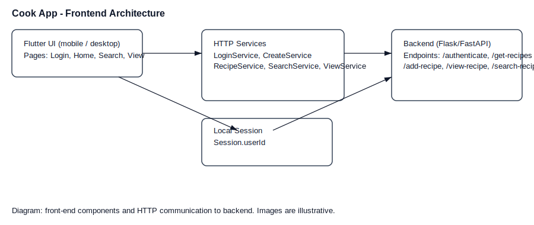

Frontend
========

This document describes the Flutter frontend included in the repository (located in `frontend/lib`). It lists the top-level pages (screens), their routes, what each page does, and the services the UI calls on the backend. For each service the expected request and response shapes are noted where they can be inferred from the code.

Contents
--------

- Overview
- App routes
- Pages (screens)
	- Login
	- Create account
	- Home (recipes list)
	- Profile / Account
	- Add recipe
	- Search recipes
	- View recipe (step-by-step)
	- Cooking techniques
- Services and API contract
- Notes and next steps

Assets
------

Included images (placeholders) are available in `docs/_static`:

- `frontend-architecture.svg` — simple architecture diagram showing the Flutter UI, service wrappers, session store and backend endpoints.
- `screenshot-login.svg` — placeholder image representing the login screen.
- `screenshot-home.svg` — placeholder image representing the home/recipes list.
- `screenshot-view.svg` — placeholder image representing the step-by-step recipe view.

You can replace these placeholder SVGs with real screenshots (PNG/JPEG) using the same filenames, or edit the RST references below to point to custom files.

Overview
--------

The frontend is a Flutter application. The entrypoint is `frontend/lib/main.dart`. The app uses named routes defined in `frontend/lib/core/routes.dart`. Shared small utilities and types live under `frontend/lib/core` (for example `session.dart` and `api_response.dart`).

App routes
----------

Defined routes (see `AppRoutes` in `core/routes.dart`):

- `/login` -> `LoginPage` (initial route)
- `/home` -> `HomePage` (accepts arguments: `username`, `newAccount`)
- `/profile` -> `AccountPage` (accepts arguments: `username`, `newAccount`)
- `/addRecipe` -> `AddRecipe`
- `/createAccount` -> `CreateAccount`
- `/techniques` -> `CookingTechniquesPage`
- `/search` -> `SearchPage`
- `/view-recipe` -> `RecipePage` (expects argument: `recipeId`)

Pages (screens)
----------------

Each page section below summarizes the UI responsibilities, inputs/outputs, navigation, and noteworthy implementation details.

Login
~~~~~

- File: `frontend/lib/features/authen/login_page.dart`
- Route: `/login` (initial route)
- Purpose: Allow existing users to authenticate with first name, last name and password, or navigate to create a new account.
- UI: three text fields (first name, last name, password), Login button, Create Account button. Validates non-empty fields.
- Behavior: on successful login the app saves `Session.userId` (from backend response JSON at `user.user_id`) and navigates to `/home` passing `username` and `newAccount` flags. On failure shows a SnackBar message.
- Backend call: uses `LoginService.authenticate` which POSTs form-encoded to `http://localhost:5000/authenticate`.

Create account
~~~~~~~~~~~~~~

- File: `frontend/lib/features/authen/create_account.dart`
- Route: `/createAccount`
- Purpose: Register a new user with first/last name, email and password.
- UI: form fields for first name, last name, email, password, confirm password. Basic validation (length, email contains `@`, password match).
- Behavior: calls `CreateService.createAccount` to POST form-encoded to `http://localhost:5000/create-account`. On success shows a confirmation SnackBar and returns (pops) to the caller. If called from the Login screen, the login screen will pick up results and navigate to `/home`.

Home (recipes list)
~~~~~~~~~~~~~~~~~~~

- File: `frontend/lib/features/recipe/home_page.dart`
- Route: `/home` (expects map args: `username`, `newAccount`)
- Purpose: Main landing page listing available recipes and quick actions (search, add recipe, techniques).
- UI: AppBar showing welcome message with username; quick action buttons; list of recipe cards. Each recipe card shows title, difficulty and image (fetched from `http://localhost:5000/recipe-image/<id>`). Pull-to-refresh loads recipes.
- Behavior: On tap of a recipe card navigates to `/view-recipe` with `recipeId`. On profile icon tap navigates to `/profile` with username/newAccount arguments.
- Backend call: fetches `GET http://localhost:5000/get-recipes` and expects JSON with top-level key `recipes`.

Profile / Account
~~~~~~~~~~~~~~~~~

- File: `frontend/lib/features/profile/profile_page.dart`
- Route: `/profile` (expects map args: `username`, `newAccount`)
- Purpose: Show and modify account details (dietary preferences, notes) and quick metrics for recipe completion. Also provides sign-out.
- UI: Decorative header with initials, filter chips for dietary options, text area for notes, a set of recipe completion cards and progress. Save and Sign out buttons.
- Behavior: local UI only in current implementation (no backend calls); sign out navigates back to `/login` and clears navigation stack.

Add recipe
~~~~~~~~~~

- File: `frontend/lib/features/add_recipe/add_recipe.dart`
- Route: `/addRecipe`
- Purpose: Form for creating a recipe with title, duration, difficulty, ingredients, steps, and images.
- UI: recipe title field, main image picker, duration (hours/minutes), difficulty dropdown (easy/medium/hard), repeatable ingredient rows (name, amount, unit, calories), repeatable step sections (description, image, duration) and nested sub-steps. Buttons to add ingredient, add step and add sub-step.
- Behavior: Constructs data payloads for ingredients and steps. Converts durations to ISO-like PT string (e.g., PT1H30M). Uses `RecipeService.addRecipe` which uploads a multipart POST request to `http://localhost:5000/add-recipe` with fields and files.
- Notes: Images are picked with `image_picker`, then attached as multipart files. Step images are named using their step index in the multipart request (backend must mirror that naming scheme).

Search recipes
~~~~~~~~~~~~~~

- File: `frontend/lib/features/search_recipe/search_page.dart`
- Route: `/search`
- Purpose: Search recipes by text query and show results as a list.
- UI: Search text field that triggers a search on change, list of results with recipe image, title and quick info (ingredients, time, difficulty).
- Behavior: Calls `SearchService.searchRecipe` to GET `http://localhost:5000/search-recipe?q=<query>`. On tap navigates to `/view-recipe` with `recipeId`.

View recipe (step-by-step)
~~~~~~~~~~~~~~~~~~~~~~~~~~

- File: `frontend/lib/features/view_recipe/view_recipe.dart`
- Route: `/view-recipe` (expects arg `recipeId`)
- Purpose: Fetch full recipe details and present step-by-step instructions, allow marking steps complete/uncomplete and show progress.
- UI: AppBar with recipe title and time, linear progress indicator, step content (including image and duration), Complete Step button and optional Go Back (undo last completed step).
- Behavior: On init the page calls `ViewService.viewRecipe(recipeId)` to GET `http://localhost:5000/view-recipe/<recipeId>?user_id=<Session.userId>` and expects a JSON response containing `recipe-title`, `recipe-time`, `recipe-difficulty` and `recipe-steps` (list). Each step in the list is mapped to an `id`, `text`, `duration` and `completed` flag. When a step is completed the app posts to `POST http://localhost:5000/complete-step` with JSON body {recipe_step_id, user_id}. To undo, it posts to `POST http://localhost:5000/uncomplete-step` with the same body.

Cooking techniques
~~~~~~~~~~~~~~~~~~

- File: `frontend/lib/features/techniques/cooking_techniques_page.dart`
- Route: `/techniques`
- Purpose: Static, local reference guide for cooking techniques (Saute, Braise, Roast, Poach). No backend communication.
- UI: List of technique cards with title, description, meta rows and quick steps.

Services and API contract
-------------------------

These classes in `frontend/lib/.../services` are thin wrappers over HTTP calls to the backend. Where possible the expected request and responses are noted below. All services return an `ApiResponse` (see `frontend/lib/core/api_response.dart`) which contains `statusCode` and the raw `response` string.

- Authentication
	- LoginService.authenticate(fname, lname, password)
		- HTTP: POST http://localhost:5000/authenticate
		- Content-Type: application/x-www-form-urlencoded
		- Body fields: user_fname, user_lname, user_password
		- Expected: 200 + JSON response containing at least {"user": {"user_id": <int>}}

	- CreateService.createAccount(fname, lname, email, password)
		- HTTP: POST http://localhost:5000/create-account
		- Content-Type: application/x-www-form-urlencoded
		- Body fields: user_fname, user_lname, user_email, user_password
		- Expected: 200 or 201 on success; response body may contain message

- Recipes / Home
	- GET http://localhost:5000/get-recipes
		- Expected JSON: {"recipes": [ { recipe fields... }, ... ] }

- Add recipe
	- RecipeService.addRecipe(name, ingredients, steps, time, difficulty, mainImage)
		- HTTP: POST multipart/form-data http://localhost:5000/add-recipe
		- Fields: recipe-title, recipe-ingredients (JSON encoded list), recipe-steps (JSON encoded list), recipe-time (string, e.g. PT1H30M), recipe-difficulty
		- Files: recipe-main-image (optional); step-image-<index> for any step images where the code uses `step['step-index']` string as label (backend must expect keys named like step-image-1, step-image-1.1, ...).
		- Expected: 200 or 201 on success

- Search
	- SearchService.searchRecipe(name)
		- HTTP: GET http://localhost:5000/search-recipe?q=<name>
		- Expected JSON: {"recipes": [ ... ] }

- View and step control
	- ViewService.viewRecipe(recipeId)
		- HTTP: GET http://localhost:5000/view-recipe/<recipeId>?user_id=<Session.userId>
		- Expected JSON fields used by UI: recipe-title, recipe-time, recipe-difficulty, recipe-steps (list). Each step is expected to have recipe-step-id, step-description, step-duration, step-completion

	- ViewService.completeStep(recipeStepId)
		- HTTP: POST http://localhost:5000/complete-step
		- Content-Type: application/Json
		- Body: {"recipe_step_id": <int>, "user_id": <int>}

	- ViewService.unCompleteStep(recipeStepId)
		- HTTP: POST http://localhost:5000/uncomplete-step
		- Content-Type: application/Json
		- Body: {"recipe_step_id": <int>, "user_id": <int>}

Notes and next steps
--------------------

- Backend host: all service calls currently use `http://localhost:5000`. If you run backend elsewhere, update service URIs accordingly.
- Error handling: services return ApiResponse with raw response text. Pages parse JSON (via jsonDecode) and assume backends return expected structures. Consider adding stronger error handling and typed models.
- Session: `frontend/lib/core/session.dart` exposes `Session.userId` (nullable int) and is used by `ViewService` and view pages. Consider expanding Session to include auth tokens in the future.
- Improvements you might consider:
	- Add shared typed models (Dart classes) for Recipe, Step, Ingredient and use `fromJson`/`toJson` for safer parsing.
	- Centralize API host and environment configuration (so URLs aren't hardcoded in multiple services).
	- Add tests for service classes and simple widget tests for pages.

This documentation was generated by reading the frontend source files under `frontend/lib` and summarizing their responsibilities and service calls.

Architecture diagram and screenshots
-----------------------------------

Example screenshots (placeholders):

.. grid:: 2
	 :gutter: 10

	 .. grid-item::
			.. image:: _static/screenshot-login.svg
				 :alt: Login screenshot

	 .. grid-item::
			.. image:: _static/screenshot-home.svg
				 :alt: Home screenshot

	 .. grid-item::
			.. image:: _static/screenshot-view.svg
				 :alt: View recipe screenshot

Detailed page / API examples
----------------------------

Below are more explicit field lists and example payloads the frontend assembles when calling the backend. These are derived from the code and should make it easier to implement backend endpoints that match the client expectations.

Login (authenticate)
~~~~~~~~~~~~~~~~~~~~~

- Endpoint: POST /authenticate
- Content-Type: application/x-www-form-urlencoded
- Form fields (client sends):

	- `user_fname` (string) — first name
	- `user_lname` (string) — last name
	- `user_password` (string) — password

- Example (form-encoded body):

	user_fname=Alice&user_lname=Smith&user_password=secret

- Expected successful response (example JSON):

	{
		"user": {
			"user_id": 42,
			"user_fname": "Alice",
			"user_lname": "Smith"
		},
		"message": "authenticated"
	}

Create account
~~~~~~~~~~~~~~

- Endpoint: POST /create-account
- Form fields: `user_fname`, `user_lname`, `user_email`, `user_password`

- Example success response: status 201 or 200 with JSON containing `message`.

Add recipe (multipart upload)
~~~~~~~~~~~~~~~~~~~~~~~~~~~~~

- Endpoint: POST /add-recipe
- Request type: multipart/form-data
- Fields the frontend adds:

	- `recipe-title` (string)
	- `recipe-ingredients` (string — JSON encoded list of ingredient objects)
	- `recipe-steps` (string — JSON encoded list of step objects)
	- `recipe-time` (string, ISO-like, e.g. PT1H30M)
	- `recipe-difficulty` (string: one of `easy`, `medium`, `hard`)

- Files the frontend may attach:

	- `recipe-main-image` — the main recipe image file (optional)
	- `step-image-<step-index>` — files for each step image. The client uses the step index (and sub-step index) in the step object `step-index` value when naming the multipart field.

- Example ingredient object (client-side list element):

	{
		"ingredient-name": "Tomato",
		"ingredient-amount": 200,
		"ingredient-unit": "g",
		"ingredient-calories": 30
	}

- Example step object:

	{
		"step-index": "1",
		"step-description": "Chop tomatoes",
		"step-duration": "PT0H10M",
		"step-image": "C:/.../temp/step1.jpg"  # client-side path only; server receives it as multipart
	}

View recipe (detailed)
~~~~~~~~~~~~~~~~~~~~~~

- Endpoint: GET /view-recipe/<recipeId>?user_id=<userId>
- Expected JSON response structure (fields used by the UI):

	{
		"recipe-title": "Tomato Pasta",
		"recipe-time": "PT0H30M",
		"recipe-difficulty": "easy",
		"recipe-steps": [
			{
				"recipe-step-id": 1,
				"step-description": "Boil water",
				"step-duration": "PT0H10M",
				"step-completion": false
			},
			...
		]
	}

Step completion
---------------

- To mark a step complete the frontend posts to `/complete-step` with JSON:

	{"recipe_step_id": <int>, "user_id": <int>}

- To undo: POST to `/uncomplete-step` with same structure.

Replacing placeholders with real screenshots
------------------------------------------

To replace the demo SVG screenshot placeholders with real images:

1. Create PNG or JPG screenshots of the app (use a device or emulator).
2. Save them in `docs/_static` and name them `screenshot-login.png`, `screenshot-home.png`, etc. (or edit the RST to point to your filenames).
3. Rebuild Sphinx: from `docs` run `sphinx-build -b html . _build/html` (see previous instructions). The new images will be included automatically.

If you'd like, I can replace the placeholder SVGs with sample PNG screenshots if you upload them here or point me to the files you'd like included.

